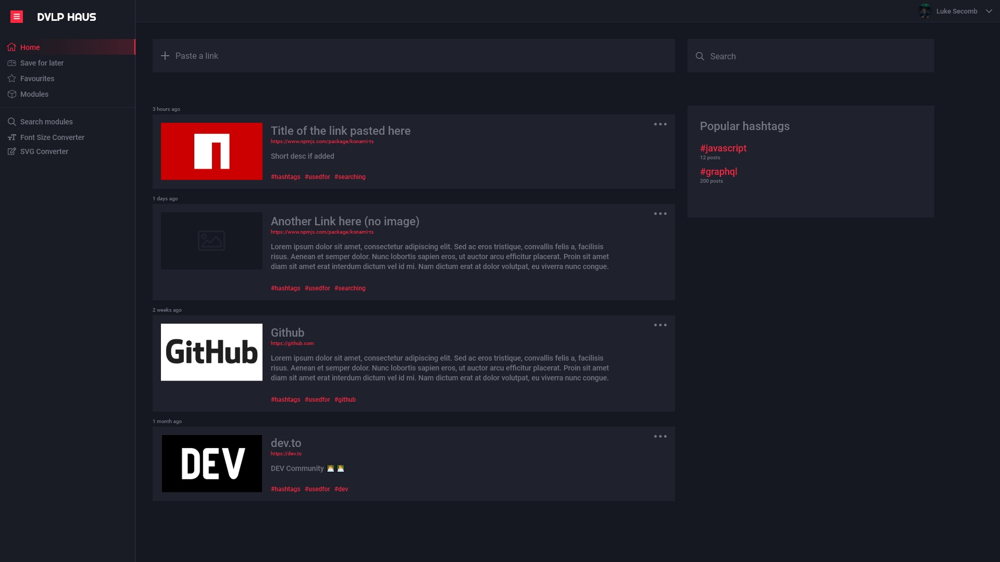

# dvlp.haus desktop

> design refresh of dvlp.haus + desktop rebuild

### Early Stages Draft Redesign



### Tech stack

- [Electron](https://electronjs.org/)
- [TypeScript](https://www.typescriptlang.org/)
- [React](https://reactjs.org/)
- [React Router (v5)](https://reacttraining.com/react-router/web)
- [Webpack](https://webpack.js.org/)
- [Jest](https://facebook.github.io/jest/)
- [SASS/SCSS](https://sass-lang.com/)

## Install

Clone the repository

Install the dependencies:

```bash
yarn
```

## Usage

```bash
yarn dev
```

## Packaging

We use [Electron Forge](https://www.electronforge.io/) to build and package the application. By default you can run the following to package for your current platform:

```bash
yarn package
```

This will create an unzipped version of your application in the `out` folder.

```bash
yarn make
```

This will create a distributable version of your app.
